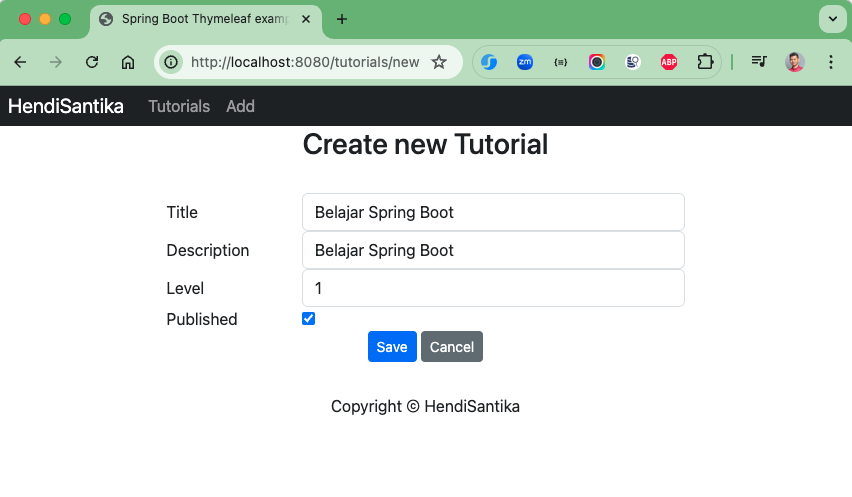
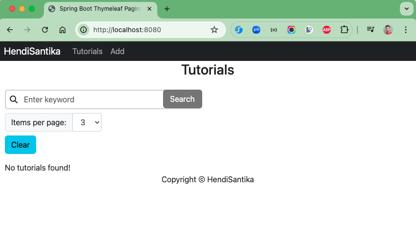
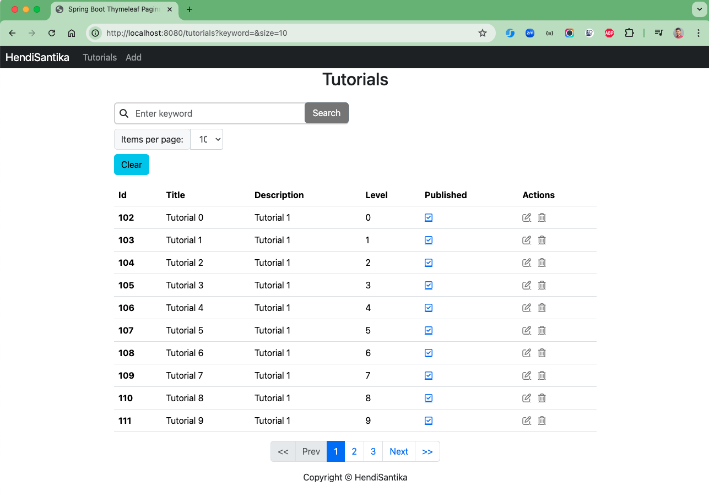
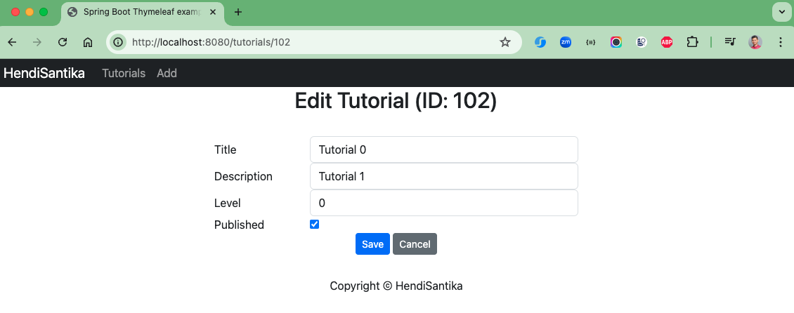

# spring-boot-crud-thymeleaf

### Things todo list

1. Clone this repository: `git clone https://github.com/hendisantika/spring-boot-crud-thymeleaf.git`
2. Navigate to the folder: `cd spring-boot-crud-thymeleaf`
3. Run the application: `mvn clean spring-boot:run`
4. Open your favorite browser: http://localhost:8080
5. Azure Link: https://thymeleaf-dra4bsergpfvaaab.southeastasia-01.azurewebsites.net/
6. Regular Link: https://thymeleaf.jvm.my.id/

### Image Screenshot

Add New Tutorial

List Add Tutorials

Edit Tutorial

